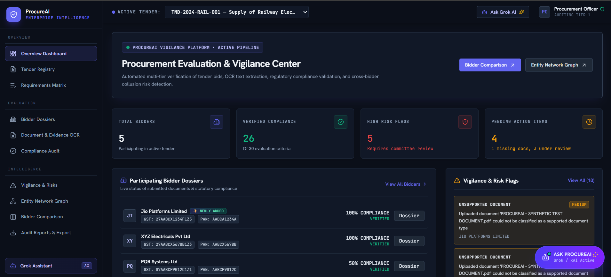
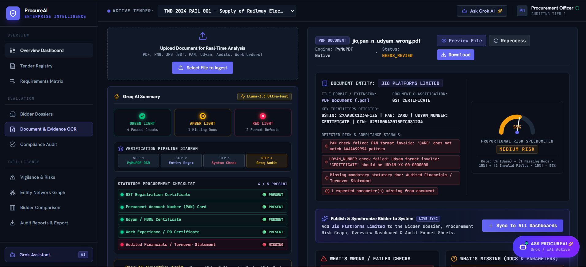
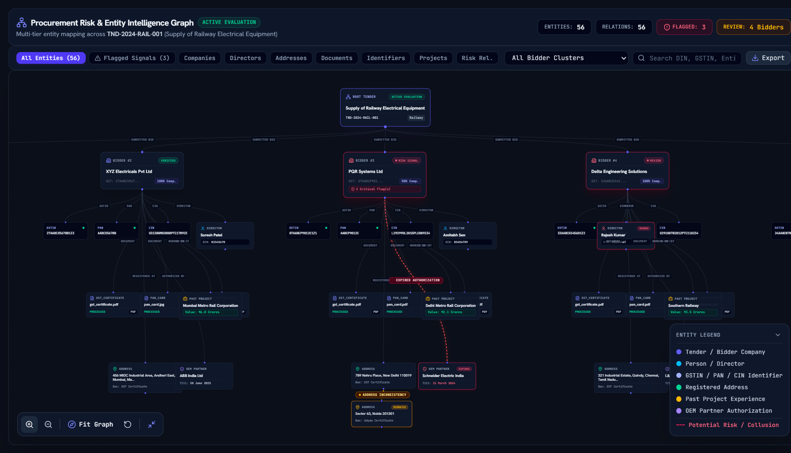
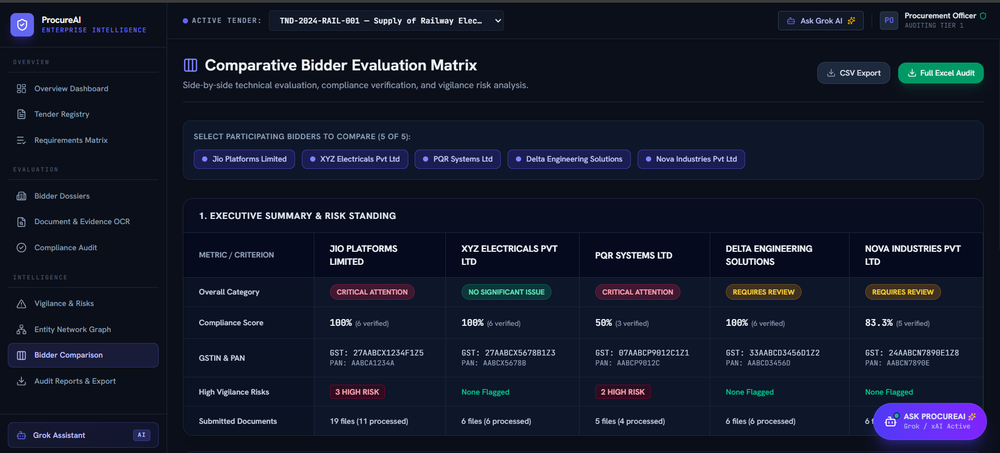
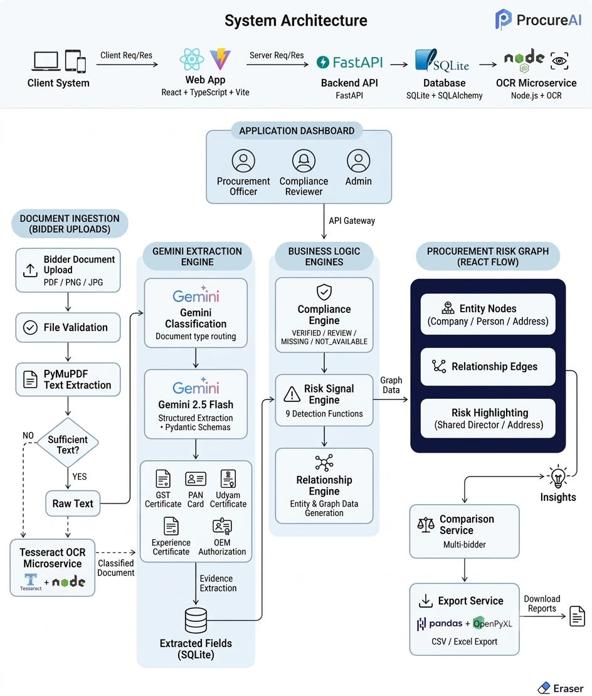
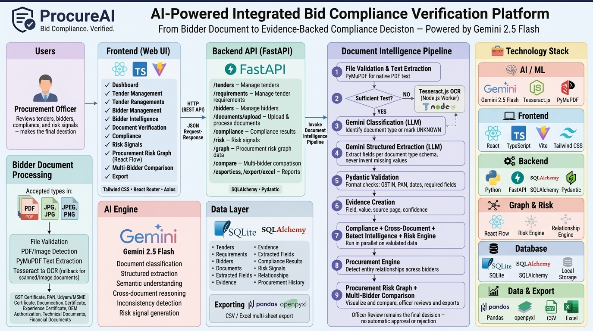

# ProcureAI — AI-Powered Integrated Bid Compliance Verification Platform

[](https://www.python.org/) [](https://fastapi.tiangolo.com/) [](https://react.dev/) [](https://www.typescriptlang.org/) [](https://vitejs.dev/) [](https://tailwindcss.com/) [](https://ai.google.dev/) [](https://groq.com/) [](https://github.com/naptha/tesseract.js) [](https://www.sqlite.org/) [](https://reactflow.dev/)

> **"From scattered bidder documents to structured, evidence-backed procurement intelligence."**

---

## 🖥️ Project






**ProcureAI** is an AI-powered procurement platform designed to help procurement officers analyze bidder documents, verify tender compliance, identify inconsistencies and potential relationships, and compare multiple bidders using structured procurement intelligence.

---

## 🎯 Problem Statement

Government and enterprise procurement involves reviewing large volumes of bidder documents such as GST certificates, PAN cards, experience certificates, OEM authorizations, technical documents, and financial documents.

Manual verification is time-consuming and makes it difficult to:

- Extract information consistently
- Cross-check information across documents
- Track bidder information across tenders
- Identify potential relationships between bidders
- Compare multiple bidders systematically

---

## 💡 Solution

ProcureAI combines **OCR, AI document understanding, deterministic validation, compliance analysis, risk analysis, bidder intelligence, and relationship visualization** into one workflow.

```text
Tender
   ↓
Requirements
   ↓
Bidder Documents
   ↓
PDF / OCR Extraction
   ↓
Gemini AI Extraction
   ↓
Pydantic Validation
   ↓
Compliance & Risk Analysis
   ↓
Bidder Intelligence
   ↓
Relationship Graph
   ↓
Multi-Bidder Comparison
   ↓
Officer Review
```

## 🏗️ System Architecture



## 🛠️ Technology Stack



---

## 📁 Project Structure

```text
procure_ai_prototype/
│
├── backend/
│   ├── routers/
│   ├── schemas/
│   ├── services/
│   ├── models/
│   ├── uploads/
│   ├── config.py
│   ├── database.py
│   ├── main.py
│   ├── seed.py
│   └── requirements.txt
│
├── frontend/
│   ├── src/
│   ├── public/
│   ├── package.json
│   └── vite.config.*
│
├── ocr_worker/
│   ├── server.js
│   ├── package.json
│   ├── package-lock.json
│   └── eng.traineddata
│
├── package.json
├── package-lock.json
└── README.md
```
